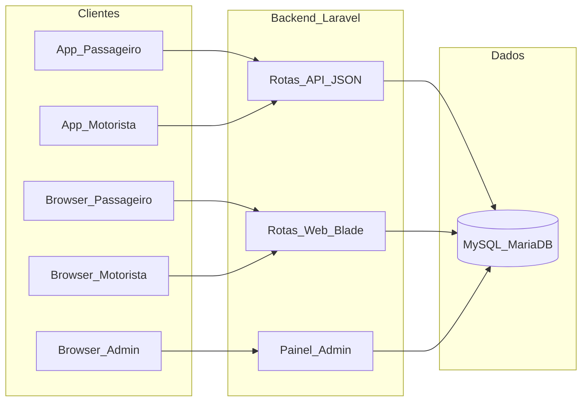
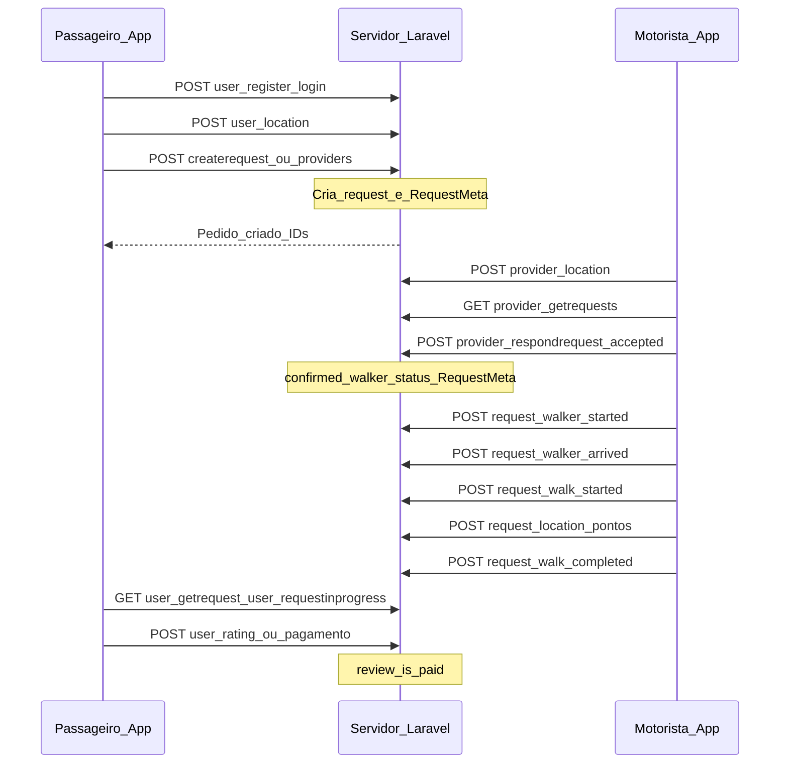
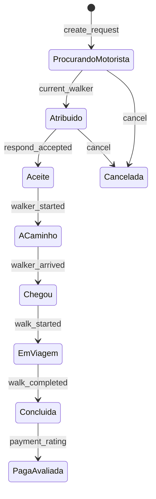

# Fluxo detalhado do sistema (Uber Clone / TaxiNox)

Documentação de leitura: como as peças se ligam com base em [`app/routes.php`](../app/routes.php), controladores (`DogController`, `WalkerController`, `OwnerController`, `WebUserController`, `WebProviderController`, `AdminController`) e no modelo de dados em [`uberx.sql`](../uberx.sql) (tabelas `request`, `request_meta`, `owner`, `walker`).

---

## 1. Quem é quem (atores e canais)

- **API**: prefixos típicos `/user/...`, `/provider/...`, `/application/...` (ver rotas).
- **Web**: `WebController` (home, páginas), `WebUserController` (`/user/...`), `WebProviderController` (`/provider/...`).
- **Admin**: rotas `/admin/...` → `AdminController`.

---

## 2. Entidade central: pedido de corrida (`request`)

A corrida vive na tabela **`request`** (estrutura em [`uberx.sql`](../uberx.sql)): `owner_id`, `status`, `confirmed_walker`, `current_walker`, flags `is_walker_started`, `is_walker_arrived`, `is_started`, `is_completed`, `is_cancelled`, `is_paid`, valores `distance` / `time` / `total`, `later` (agendado), etc.

Quando vários motoristas podem ser contactados, entra **`request_meta`**: uma linha por `(request_id, walker_id)` com `status` próprio até haver aceitação (lógica em `WalkerController@respond_request`, que atualiza `request`, `request_meta` e `walker.is_available`).

---

## 3. Fluxo feliz (API) — visão sequencial

Ordem lógica usada pelas apps; os nomes exatos dos endpoints estão em [`app/routes.php`](../app/routes.php).

Pontos importantes:

1. **Criação do pedido** — `DogController` (ex.: `create_request`, `create_request_providers`, `create_request_later`): grava `request`, linhas em `request_services`, e candidatos em `request_meta` / atribui `current_walker` conforme a lógica de dispatch.
2. **Motorista vê pedidos** — `WalkerController@get_requests` / `get_request`.
3. **Aceitar** — `WalkerController@respond_request`: se `accepted == 1` e `current_walker == walker_id`, atualiza `confirmed_walker`, `status`, `request_meta`, marca motorista indisponível, remove meta dos outros candidatos, pode enviar notificações.
4. **Fases da viagem** — endpoints `request_walker_started`, `request_walker_arrived`, `request_walk_started`, `walk_location`, `request_walk_completed` atualizam as flags e totais no `request`.
5. **Passageiro acompanha** — `get_request`, `request_in_progress`, `get_walk_location`, ETA, etc.
6. **Fecho** — pagamento (`is_paid`, modos em `payment_mode` / integrações), avaliações (`user/rating`, `provider/rating` / tabelas `review_*`).

---

## 4. Fluxo web (browser) — paralelo simplificado

Não duplica toda a API, mas espelha o negócio por **sessão** (`Session::put('user_id'| 'walker_id')`):

- **Passageiro**: [`app/controllers/WebUserController.php`](../app/controllers/WebUserController.php) — signin/signup, `userTrips`, pedido de viagem (`request-trip`, `saveUserRequestTrip`), pagamentos PayPal web, perfil.
- **Motorista**: [`app/controllers/WebProviderController.php`](../app/controllers/WebProviderController.php) — registo com ativação por email, signin, disponibilidade, lista/detalhe de viagens, mudança de estado da corrida, documentos.

O **mapa** `/find` e **rastreamento** `track/{id}` ligam o utilizador web ao mesmo universo de pedidos.

---

## 5. Painel admin — o que encaixa no fluxo

[`app/controllers/AdminController.php`](../app/controllers/AdminController.php) opera **sobre as mesmas tabelas**:

- Aprovar / recusar **motoristas** e **pedidos** manualmente.
- **Trocar motorista** num pedido, ver **mapa**, **pagar** prestador / **cobrar** utilizador.
- **Configurações** (tarifas, unidades, integrações), **promo codes**, tipos de serviço/documentos, **keywords** da UI.
- **Relatórios** e listagens com pesquisa/ordenação.

Isto é uma camada **operacional e de configuração** em cima do fluxo da secção 3.

---

## 6. Outros fluxos transversais

- **Autenticação API**: tokens em `owner` / `walker` (validade `token_expiry`); muitos métodos verificam token como em `respond_request`.
- **Pagamentos**: rotas Owner/Walker + web (Stripe/Braintree/PayPal/Bitcoin conforme config) — o fluxo de corrida pode exigir `is_paid` antes ou depois do “completed”, conforme regra do pedido.
- **Agendamento** (`later`): mesma tabela `request` com `later = 1`; calendário/disponibilidade (`ProviderAvail`) entra na aceitação.
- **Instalador** `/install`: configura BD e chaves externas — não faz parte do fluxo operacional diário.
- **Legado** `/dog/*`, `/walk/*`: rotas antigas ligadas ao mesmo domínio (nomes históricos); o fluxo principal moderno está em `/user/*` e `/provider/*`.

---

## 7. Diagrama mental “estados do pedido”

Em termos de negócio (não são todos os valores numéricos de `status` no código, mas a ideia):

---

## Referência rápida de ficheiros

| Área | Ficheiros principais |
|------|---------------------|
| Rotas | [`app/routes.php`](../app/routes.php) |
| API passageiro / pedido | `DogController`, `OwnerController` |
| API motorista | `WalkerController` |
| Web | `WebUserController`, `WebProviderController`, `WebController` |
| Admin | `AdminController` |
| Modelo pedido | `Requests`, `RequestMeta`, `RequestServices` em `app/models/` + SQL `request*` em `uberx.sql` |

Para aprofundar um só eixo (só API, só admin, ou só pagamentos), estende este documento ou consulta os métodos referidos nas rotas.
